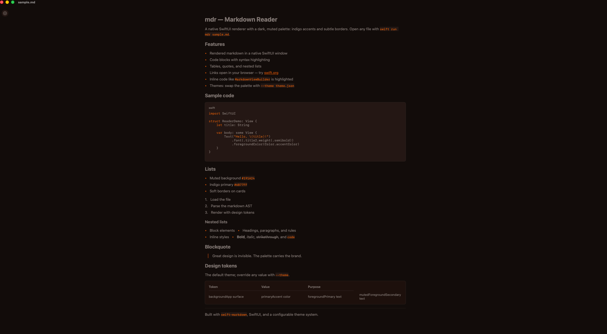
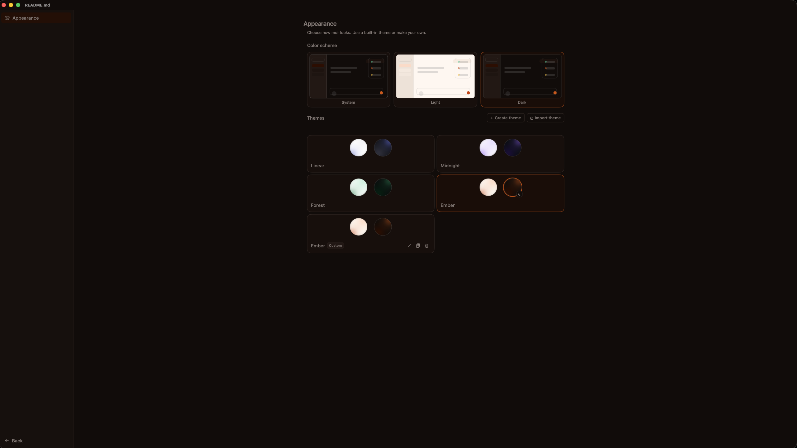

# mdr — Markdown Reader

A simple CLI tool that opens a native SwiftUI window rendering one or more
markdown files, with a dark, Linear-inspired design system and configurable
themes.



The theme editor UI is taken entirely from [t3code](https://github.com/t3dotgg/t3code).



## Features

- Renders one or more markdown files in a native macOS window
- Dark-first design system inspired by Linear's design tokens
- Custom themes via JSON config (`--theme` or `~/.config/mdr/theme.json`)
- Syntax highlighting for code blocks
- Appearance mode switching (System / Light / Dark)

## Requirements

- macOS 13 or later
- Swift 6 toolchain (to build)

## Install

Build a release binary and place it on your `PATH`:

```bash
swift build -c release
cp .build/release/mdr /usr/local/bin/mdr
```

The release binary is a single, self-contained Mach-O with no third-party
runtime dependencies.

## Usage

```bash
mdr file.md                 # open one or more files
mdr --theme theme.json file.md   # load design tokens from a JSON config
mdr --help                  # usage
mdr --version               # version
```

Themes default to `~/.config/mdr/theme.json` when no `--theme` is given.

## Architecture

`mdr` (thin app shell) → `MDReaderCore` (pure rendering logic) →
`swift-markdown`. See `AGENTS.md` for details.